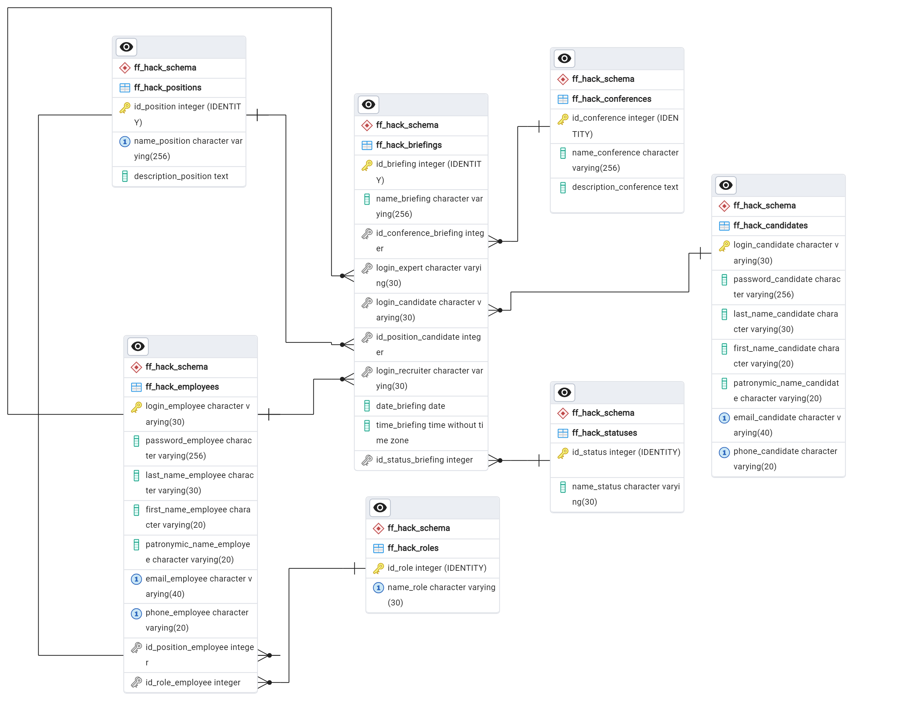
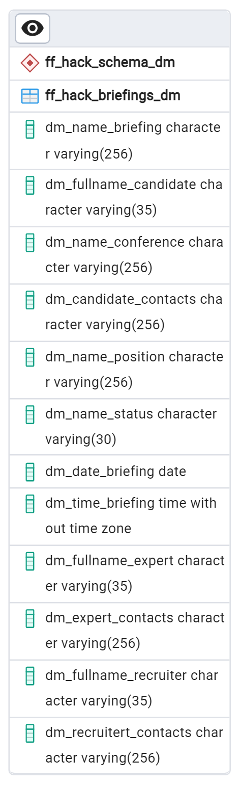

# Описание файлов
| № п / п |	Файл | Описание |
|---------|------|----------|
| 1. | create_code_db.sql | Код создания БД |
| 2. | create_code_dm.sql | Код создания витрины данных |
| 3. | inserts_code.sql | Код наполнения тестовыми данными |
| 4. | create_functions_code.sql | Код создания функций и процедур |
| 5. | erd_db.pgerd | Проект ERD БД |
| 6. | erd_dm.pgerd | Проект ERD витрины данных |

## Описание функций
Описание функций расположено в файле: <a href="README_FUNC.md">README_FUNC.md</a>

# Структура базы данных проекта «Разработка сервиса для организации собеседований»
База данных (БД) проекта «Разработка сервиса для организации собеседований» является модулем, отвечающим за хранение и взаимосвязь данных между участниками конференций (встреч), позволяет вести аналитику в рамках данных в БД, а также предоставляет функционал  управления данными о  конференциях (встречах).

## Структура базы данных и связи между сущностями
Структура БД представлена ниже в виде таблиц с описанием полей, их характеристиками, связью через первичный и внешний ключи (PK / FK), а также их назначением.
Имя БД – «*cnrprod1722884901-team-74157*». БД является предоставленной, ненаполненной и расположенной на стороне Заказчика. В рамках БД направленность по проекту отражена в схеме «*ff_hack_schema*».

### Сущность «*ff_hack_positions*»
Сущность «*ff_hack_positions*» содержит информацию о должностях, имеющихся на предприятии Заказчика. Описание полей сущности представлена в таблице 1.

**Таблица 1 – Поля сущности «*ff_hack_positions*»**
| № п / п |	Поле | Тип данных |	Ограничения | Описание |
|---------|------|------------|-------------|----------|
| 1. | id_position | INTEGER | PK, NOT NULL | Уникальный идентификатор должности в таблице |
| 2. | name_position | VARCHAR(256) | NOT NULL, UNIQUE | Наименование должности |
| 3. | description_position | TEXT | – | Описание должности |

### Сущность «*ff_hack_roles*»
Сущность «*ff_hack_roles*» содержит информацию о ролях, участвующих в проведении конференции (встречи): эксперт, рекрутер (HR), кандидат. Описание полей сущности представлена в таблице 2.

**Таблица 2 – Поля сущности «*ff_hack_roles*»**
| № п / п |	Поле | Тип данных |	Ограничения | Описание |
|---------|------|------------|-------------|----------|
| 1. | id_role | INTEGER | PK, NOT NULL | Уникальный идентификатор роли в таблице |
| 2. | name_role | VARCHAR(30) | NOT NULL, UNIQUE	| Наименование роли |

### Сущность «*ff_hack_employees*»
Сущность «*ff_hack_employees*» содержит информацию о сотрудниках, трудоустроенных на предприятии Заказчика. Описание полей сущности представлена в таблице 3.

**Таблица 3 – Поля сущности «*ff_hack_employees*»**
| № п / п |	Поле | Тип данных |	Ограничения | Описание |
|---------|------|------------|-------------|----------|
| 1. | login_employee | VARCHAR(30) | PK, NOT NULL | Уникальный логин сотрудника |
| 2. | password_employee | VARCHAR(256) | NOT NULL | Хеш пароля сотрудника |
| 3. | last_name_employee | VARCHAR(30) | NOT NULL | Фамилия сотрудника |
| 4. | first_name_employee | VARCHAR(20) | NOT NULL | Имя сотрудника |
| 5. | patronymic_name_employee | VARCHAR(20) | – | Отчество сотрудника |
| 6. | email_employee | VARCHAR(20) | NOT NULL, UNIQUE | Электронная почта сотрудника |
| 7. | phone_employee | VARCHAR(20) | NOT NULL, UNIQUE | Телефонный номер сотрудника |
| 8. | id_position_employee | INTEGER | FK, NOT NULL | Идентификатор должности (внешний ключ, таблица ff_hack_positions) |
| 9. | id_role_employee | INTEGER | FK, NOT NULL | Идентификатор роли (внешний ключ, таблица ff_hack_roles) |

### Сущность «*ff_hack_candidates*»
Сущность «*ff_hack_candidates*» содержит информацию о кандидатах, с которыми производится конференция (встреча) сотрудников предприятия Заказчика. Описание полей сущности представлена в таблице 4.

**Таблица 4 – Поля сущности «*ff_hack_candidates*»**
| № п / п |	Поле | Тип данных |	Ограничения | Описание |
|---------|------|------------|-------------|----------|
| 1. | login_candidate | VARCHAR(30) | PK, NOT NULL | Уникальный логин кандидата |
| 2. | password_candidate | VARCHAR(256) | NOT NULL | Хеш пароля кандидата |
| 3. | last_name_candidate | VARCHAR(30) | NOT NULL | Фамилия кандидата |
| 4. | first_name_candidate | VARCHAR(20) | NOT NULL | Имя кандидата |
| 5. | patronymic_name_candidate | VARCHAR(20) | – | Отчество кандидата |
| 6. | email_candidate | VARCHAR(20) | NOT NULL, UNIQUE | Электронная почта кандидата |
| 7. | phone_candidate | VARCHAR(20) | NOT NULL, UNIQUE | Телефонный номер кандидата |

### Сущность «*ff_hack_conferences*»
Сущность «*ff_hack_conferences*» содержит информацию о конференциях (встречах), как обобщенном критерии: категория. Описание полей сущности представлена в таблице 5.

**Таблица 5 – Поля сущности «*ff_hack_conferences*»**
| № п / п |	Поле | Тип данных |	Ограничения | Описание |
|---------|------|------------|-------------|----------|
| 1. | id_conference | INTEGER | PK, NOT NULL | Уникальный идентификатор конференции в таблице |
| 2. | name_conference | VARCHAR(256) | NOT NULL | Наименование конференции |
| 3. | description_conference | TEXT | – | Описание конференции |

### Сущность «*ff_hack_statuses*»
Сущность «*ff_hack_statuses*» содержит перечень возможных статусов конференции. Описание полей сущности представлена в таблице 6.

**Таблица 6 – Поля сущности «*ff_hack_statuses*»**
| № п / п |	Поле | Тип данных |	Ограничения | Описание |
|---------|------|------------|-------------|----------|
| 1. | id_status | INTEGER | PK, NOT NULL | Уникальный идентификатор статуса в таблице |
| 2. | name_status | VARCHAR(30) | NOT NULL | Наименование статуса |

### Сущность «*ff_hack_briefings*»
Сущность «*ff_hack_briefings*» содержит информацию о каких-либо созданных конференциях (встречах). Описание полей сущности представлена в таблице 7.

**Таблица 7 – Поля сущности «*ff_hack_briefings*»**
| № п / п |	Поле | Тип данных |	Ограничения | Описание |
|---------|------|------------|-------------|----------|
| 1. | id_briefing | INTEGER | PK, NOT NULL | Уникальный идентификатор брифинга в таблице |
| 2. | name_briefing | VARCHAR(256) | NOT NULL | Наименование брифинга |
| 3. | id_conference_briefing | INTEGER | FK, NOT NULL | Идентификатор конференции (внешний ключ, таблица ff_hack_conferences) |
| 4. | login_expert | VARCHAR(30) | FK, NOT NULL | Логин сотрудника-эксперта (внешний ключ, таблица ff_hack_employees) |
| 5. | login_candidate | VARCHAR(30) | FK, NOT NULL | Логин кандидата (внешний ключ, таблица ff_hack_candidates) |
| 6. | id_position_candidate | INTEGER | FK, NOT NULL | Идентификатор должности (внешний ключ, таблица ff_hack_positions) |
| 7. | login_recruiter | VARCHAR(30) | FK, NOT NULL | Логин сотрудника-рекрутера (HR) (внешний ключ, таблица ff_hack_employees) |
| 8. | date_briefing | DATE | NOT NULL | Дата проведения конференции |
| 9. | time_briefing | TIME | NOT NULL | Время проведения конференции |
| 10. | id_status_briefing | INTEGER | FK, NOT NULL | Идентификатор статуса (внешний ключ, таблица ff_hack_statuses) |

## ER-диаграмма базы данных
Графическое представление БД проекта приведено на рис. 1 в виде ER-диаграммы.

  
    
  Рисунок 1 – ER-диаграмма БД

## Структура витрины базы данных
Структура витрины БД представлена ниже в виде таблицы с описанием полей, их характеристиками и назначением.
Имя БД – «*cnrprod1722884901-team-74157*». БД является предоставленной, ненаполненной и расположенной на стороне Заказчика. В рамках БД направленность по витрине данных отражена в схеме «*ff_hack_schema_dm*».

### Сущность «*ff_hack_briefings_dm*»
Сущность «*ff_hack_briefings_dm*» содержит информацию об имеющихся конференциях (встречах), участниках, их контактов, времени и статусе, являясь по своему назначению сводной.
 
**Таблица 8 – Поля сущности «*ff_hack_briefings_dm*»**
| № п / п |	Поле | Тип данных |	Ограничения | Описание |
|---------|------|------------|-------------|----------|
| 1. | dm_name_briefing | VARCHAR(256) | NOT NULL	Наименование брифинга |
| 2. | dm_fullname_candidate | VARCHAR(35) | NOT NULL | Фамилия и инициалы кандидата |
| 3. | dm_name_conference | VARCHAR(256) | NOT NULL | Тип конференции |
| 4. | dm_candidate_contacts | VARCHAR(256) | NOT NULL | Контакты кандидата |
| 5. | dm_name_position | VARCHAR(256) | NOT NULL | Наименование собеседуемой должности |
| 6. | dm_name_status | VARCHAR(30) | NOT NULL | Статус конференции |
| 7. | dm_date_briefing | DATE | NOT NULL | Дата конференции |
| 8. | dm_time_briefing | TIME | NOT NULL | Время конференции |
| 9. | dm_fullname_expert | VARCHAR(35) | NOT NULL | Фамилия и инициалы эксперта |
| 10. | dm_expert_contacts | VARCHAR(256) | NOT NULL | Контакты эксперта |
| 11. | dm_fullname_recruiter | VARCHAR(35) | NOT NULL | Фамилия и инициалы рекрутера (HR) |
| 12. | dm_recruitert_contacts | VARCHAR(256) | NOT NULL | Контакты рекрутера (HR) |

## ER-диаграмма базы данных
Графическое представление БД витрины данных приведено на рис. 2 в виде ER-диаграммы.

  
   
  Рисунок 2 – ER-диаграмма витрины данных

